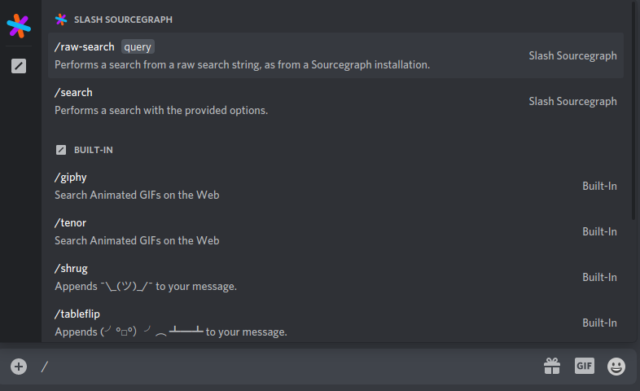
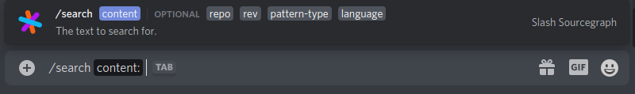
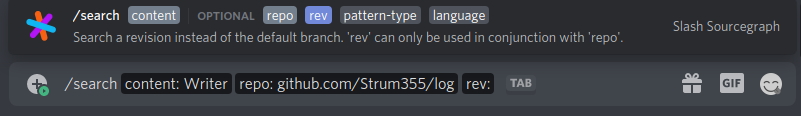
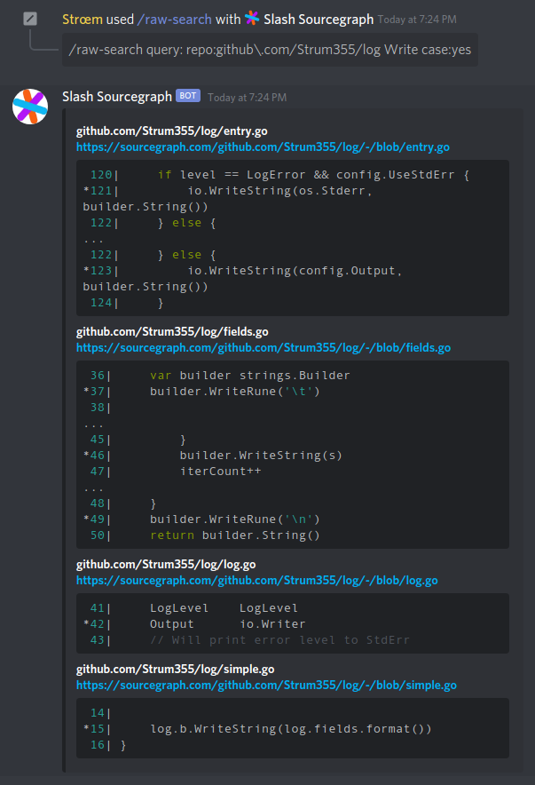

# Slash Sourcegraph
## Discord Slash Commands Service for Sourcegraph search

A service that integrates with Discord's new [slash commands](https://discord.com/developers/docs/interactions/slash-commands) integration for (somewhat) client-side validated command arguments. Integrates with [Sourcegraph](https://sourcegraph.com) to display search results in Discord.

Terraform and Ansible files are included, with sensitive info behind Ansible Vault and/or git-crypt : )

## Tech Used

Brief list of some of the cool tech that made this possible:

1. [Caddy](https://caddyserver.com) and Carson Hoffman's [Discord Interactions Verifier Caddy plugin](https://github.com/CarsonHoffman/caddy-discord-interactions-verifier).
2. [Kotlin Ktor](https://ktor.io/) and [Expedia's Kotlin GraphQL client](https://github.com/ExpediaGroup/graphql-kotlin).
3. [Sourcegraph](https://sourcegraph.com) of course.
4. [Ansible](https://www.ansible.com/) and [Terraform](https://www.terraform.io/).

## Screenshots

